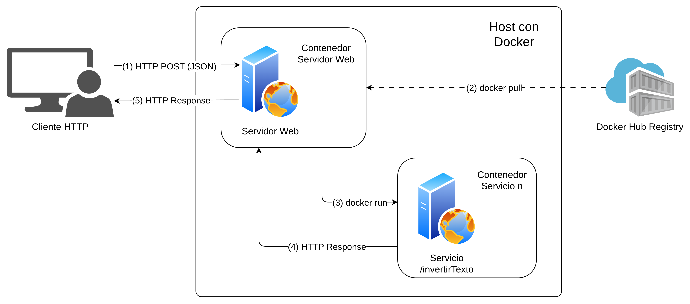

### HIT 1

# ENUNCIADO

Implemente un servidor que resuelva “tareas genéricas” o “pre-compiladas”. Para ello, hay un conjunto de acciones de diseño y arquitectura que deben respetarse:

### SERVIDOR
* Desarrollar el servidor utilizando tecnología HTTP.
* El servidor debe ser contenerizado y alojado en un host con Docker instalado.
* Permanecerá receptivo a nuevas solicitudes del cliente, exponiendo métodos para interactuar.
* Debe incluir un método llamado ejecutarTareaRemota() asociado a un endpoint (getRemoteTask()) para procesar tareas genéricas enviadas por el cliente.
* Los parámetros de las tareas serán recibidos a través de solicitudes HTTP GET/POST, utilizando una estructura JSON.
* Durante la ejecución, el servidor levantará temporalmente un “servicio tarea” como un contenedor Docker.
* Una vez en funcionamiento, se comunicará con el “servicio tarea” para ejecutar la tarea con los parámetros proporcionados.
* Esperará los resultados de la tarea y los enviará de vuelta al cliente.

### SERVICIO TAREA
* Establecer un servicio de escucha utilizando un servidor web.
* Implementar la tarea de procesamiento denominada ejecutarTarea().
* Configurar el servicio para recibir los parámetros de entrada en formato JSON.
* Empaquetar la solución como una imagen Docker para facilitar la distribución y el despliegue.
* Publicar la solución en el registro de Docker Hub, ya sea público o privado, para que esté disponible para su uso y colaboración.

### CLIENTE
* Utilizar una solicitud HTTP GET/POST para comunicarse con el servidor.
* Enviar los parámetros necesarios para la tarea en formato JSON, incluyendo:
    * El cálculo a realizar.
    * Los parámetros específicos requeridos para la tarea.
    * Datos adicionales necesarios para el procesamiento.
    * La imagen Docker que contiene la solución de la tarea.


---

### 1. Requisitos

Software necesario para ejecutar el proyecto.

* Sistema operativo: Linux / macOS / Windows
* Lenguaje: Python 3.12
* Docker instalado y corriendo en el host
* Dependencias: especificadas en cada `requirements.txt`

Comandos según sistema operativo:

| Sistema | Comando Python  |
| ------- | --------------- |
| Linux   | `python3`       |
| macOS   | `python3`       |
| Windows | `python` o `py` |

---

### 2. Estructura de archivos

```
hit1/
├── servicio_a/
│   ├── app/
│   │   └── servicio_inversion_texto.py
│   ├── tests/
│   │   └── test_servicio_a.py
│   ├── Dockerfile
│   └── requirements.txt
├── servicio_b/
│   ├── app/
│   │   └── servicio_hashing.py
│   ├── tests/
│   │   └── test_servicio_b.py
│   ├── Dockerfile
│   └── requirements.txt
├── servidor/
│   ├── app/
│   │   └── servidor.py
│   ├── tests/
│   ├── Dockerfile
│   └── requirements.txt
└── README.md
```

#### Diagrama de arquitectura



---

### 3. Servicios disponibles

| Servicio | Imagen Docker | Endpoint | Descripción |
| -------- | ------------- | -------- | ----------- |
| texto | `valen190306/sd-tp2-hit1-servicio-a:latest` | `/invertirTexto` | Invierte el texto recibido |
| hash | `valen190306/sd-tp2-hit1-servicio-b:latest` | `/hash` | Calcula el hash de un valor |

---

### 4. Ejecución del servidor

* IMPORTANTE: Si se ejecuta desde Windows Docker Desktop debe estar en ejecución

Build imagen del servidor:
```bash y Windows
cd hit1/servidor
docker build -t servidor-hit1 .
```

Levantár el servidor:
```bash
docker run -d \
  -p 5001:8080 \
  -v /var/run/docker.sock:/var/run/docker.sock \
  --name servidor \
  servidor-hit1
```

```Windows
docker run -d -p 5001:8080 -v /var/run/docker.sock:/var/run/docker.sock --name servidor servidor-hit1
```

Verificar que está corriendo:
```bash y Windows
curl http://localhost:5001/health
```

---

### 5. Uso del endpoint

**POST** `/getRemoteTask`

Ejemplo — inversión de texto:
```bash
curl -X POST http://localhost:5001/getRemoteTask \
  -H "Content-Type: application/json" \
  -d '{
    "servicio": "texto",
    "payload": {"texto": "hola mundo"}
  }'
```

```Windows
curl.exe --% -X POST http://localhost:5001/getRemoteTask -H "Content-Type: application/json" -d "{ \"servicio\": \"texto\", \"payload\": {\"texto\": \"hola mundo\"} }"
```

Resultado esperado:
```json
{
  "servicio": "texto",
  "resultado": {"resultado": "odnum aloh"}
}
```


Ejemplo — hashing:
```bash
curl -X POST http://localhost:5001/getRemoteTask \
  -H "Content-Type: application/json" \
  -d '{
    "servicio": "hash",
    "payload": {"input": "hola", "algoritmo": "sha256"}
  }'
```

```Windows
curl.exe --% -X POST http://localhost:5001/getRemoteTask -H "Content-Type: application/json" -d "{ \"servicio\": \"hash\", \"payload\": {\"input\": \"hola\", \"algoritmo\": \"sha256\"} }"
```

Resultado esperado:
```json
{
  "servicio": "hash",
  "resultado": {"algoritmo":"sha256", "hash":"b221d9dbb083a7f33428d7c2a3c3198ae925614d70210e28716ccaa7cd4ddb79"}
}
```

---

### 6. Ejecución de tests

* Desde el directorio hit1/

Servicio A:
```bash y Windows
pytest servicio_a/tests/ -v
```

Servicio B:
```bash y Windows
pytest servicio_b/tests/ -v
```

Servidor:
```bash y Windows
pytest servidor/tests/ -v
```

---

### 7. Resultado esperado de los tests

* El servidor responde correctamente al health check.
* Las solicitudes sin campo `servicio` devuelven error 400.
* Los servicios no soportados devuelven error 400.
* Una tarea válida se ejecuta en un contenedor temporal y devuelve resultado correcto.

---

## Conclusión

El servidor actúa como orquestador: recibe una tarea, levanta el contenedor correspondiente, ejecuta la lógica delegada en el servicio, y destruye el contenedor al finalizar. Las credenciales de Docker Hub nunca se exponen en el payload del request.