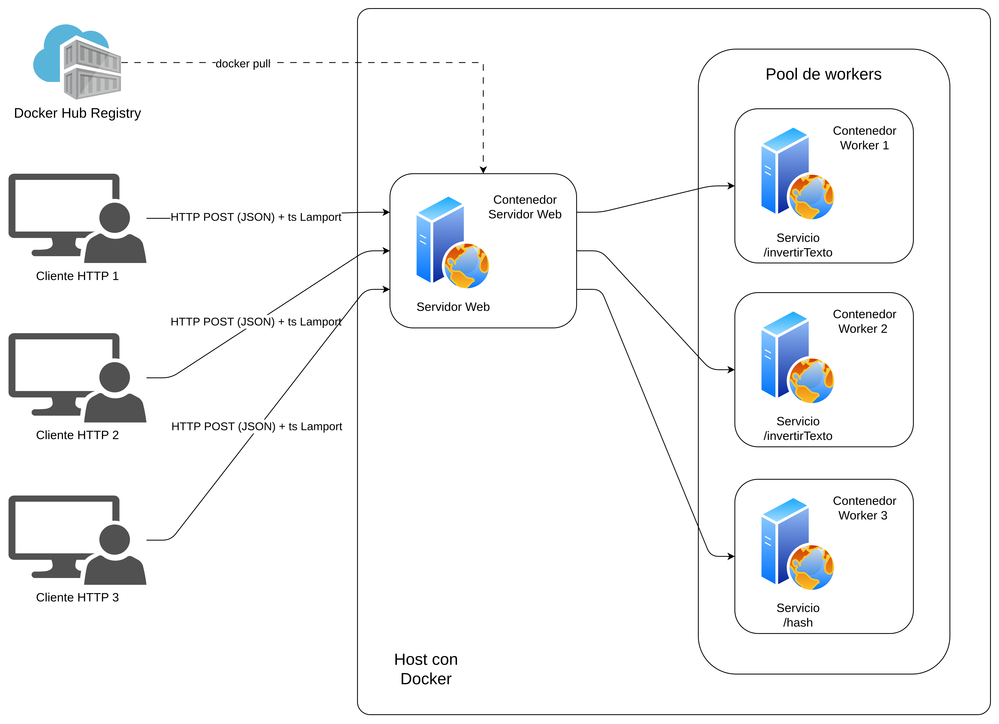

### HIT 2

# Enunciado

Modifique el servidor del Hit #1 para que acepte múltiples tareas concurrentes. Para ello:
1. Pool de workers: Implemente un pool de workers con un límite configurable (por ejemplo, N workers máximos). Cada worker ejecuta una tarea en un contenedor Docker independiente.
2. Exclusión mutua: Cuando llegan más tareas que workers disponibles, las tareas deben encolarse. Implemente la cola con exclusión mutua para garantizar que no haya condiciones de carrera al asignar tareas a workers. Puede utilizar un mutex distribuido o implementar el algoritmo de Lamport para el acceso a la cola compartida.
4. Relojes lógicos: Implemente timestamps lógicos (relojes de Lamport) en los mensajes entre cliente y servidor para ordenar las solicitudes de manera consistente.
5. Medición de throughput: Mida y documente el throughput del sistema (tareas completadas por minuto) variando la cantidad de workers: 1, 2, 4 y 8. Presente los resultados en una tabla y grafique la curva de escalabilidad. Analice si el speedup es lineal o si hay un cuello de botella. Considerando que todo corre en un solo equipo: ¿cuáles son los recursos compartidos que podrían convertirse en cuello de botella (CPU, memoria, I/O de disco, red de Docker, daemon de Docker)? ¿Cómo los identificaría y mediría?

---

### 1. Requisitos

Software necesario para ejecutar el proyecto.

* Sistema operativo: Linux / macOS / Windows
* Lenguaje: Python 3.12
* Docker instalado y corriendo en el host
* Dependencias: especificadas en `requirements.txt`

Comandos según sistema operativo:

| Sistema | Comando Python  |
| ------- | --------------- |
| Linux   | `python3`       |
| macOS   | `python3`       |
| Windows | `python` o `py` |

---

### 2. Estructura de archivos

```
hit2/
├── servidor/
│   ├── app/
│   │   └── servidor.py
│   ├── test/
│   │   └── test_servidor.py
│   ├── Dockerfile
│   └── requirements.txt
└── README.md
```

Archivos principales:
* `servidor/app/servidor.py` — servidor HTTP con pool de workers, cola con exclusión mutua y relojes de Lamport
* `servidor/test/test_servidor.py` — script de pruebas automáticas

> **Nota:** Los servicios de tareas (inversión de texto y hashing) son los mismos del Hit #1. El servidor del Hit #2 consume las imágenes Docker ya publicadas en Docker Hub por el Hit #1 (`valen190306/sd-tp2-hit1-servicio-a:latest` y `valen190306/sd-tp2-hit1-servicio-b:latest`). 

---

### 3. Componentes implementados

| Componente | Descripción |
| ---------- | ----------- |
| Pool de workers | Semáforo con límite configurable `MAX_WORKERS`. Cada worker levanta un contenedor Docker independiente |
| Cola con exclusión mutua | `PriorityQueue` protegida con `threading.Lock`. Las tareas se ordenan por timestamp de Lamport |
| Relojes de Lamport | Cada request incluye `lamport_ts`. El servidor actualiza su reloj con `max(local, cliente) + 1` y devuelve su propio timestamp en la respuesta |
| Métricas de throughput | Endpoint `/metricas` que expone tareas completadas, tiempo transcurrido y throughput por minuto |

#### Diagrama de arquitectura



---

### 4. Ejecución del servidor

Buildeá la imagen:
```bash
cd hit2/servidor
docker build -t servidor-hit2 .
```

Levantá el servidor (ejemplo con 4 workers):
```bash
docker run -d \
  -p 5002:8080 \
  -e MAX_WORKERS=4 \
  -v /var/run/docker.sock:/var/run/docker.sock \
  --name servidor \
  servidor-hit2
```

Para variar la cantidad de workers cambiá el valor de `MAX_WORKERS`:
```bash
# 1 worker
docker run -d -p 5002:8080 -e MAX_WORKERS=1 -v /var/run/docker.sock:/var/run/docker.sock --name servidor servidor-hit2

# 2 workers
docker run -d -p 5002:8080 -e MAX_WORKERS=2 -v /var/run/docker.sock:/var/run/docker.sock --name servidor servidor-hit2

# 8 workers
docker run -d -p 5002:8080 -e MAX_WORKERS=8 -v /var/run/docker.sock:/var/run/docker.sock --name servidor servidor-hit2
```

Verificá que está corriendo:
```bash
curl http://localhost:5002/health
```

---

### 5. Uso del endpoint

**POST** `/getRemoteTask`

El campo `lamport_ts` es el timestamp lógico del cliente. Si no se envía, se asume 0.

Ejemplo — inversión de texto:
```bash
curl -X POST http://localhost:5002/getRemoteTask \
  -H "Content-Type: application/json" \
  -d '{
    "servicio": "texto",
    "payload": {"texto": "hola mundo"},
    "lamport_ts": 1
  }'
```

Resultado esperado:
```json
{
  "servicio": "texto",
  "resultado": {"resultado": "odnum aloh"},
  "lamport_ts": 3,
  "tarea_id": "tarea-a1b2c3"
}
```

---

### 6. Métricas de throughput

**GET** `/metricas`

```bash
curl http://localhost:5002/metricas
```

Resultado esperado:
```json
{
  "workers_max": 4,
  "tareas_completadas": 12,
  "tiempo_segundos": 45.2,
  "throughput_por_minuto": 15.93,
  "cola_pendiente": 0
}
```

---

### 7. Medición de escalabilidad

Para medir el throughput variando workers, levantá el servidor con cada valor de `MAX_WORKERS`, enviá un lote de requests concurrentes y consultá `/metricas`.

Tabla de resultados esperada:

| Workers | Tareas completadas | Tiempo (s) | Throughput (tareas/min) |
| ------- | ------------------ | ---------- | ----------------------- |
| 1       |                    |            |                         |
| 2       |                    |            |                         |
| 4       |                    |            |                         |
| 8       |                    |            |                         |

Recursos compartidos que pueden convertirse en cuello de botella en un solo equipo:

* **CPU**: saturación de cores si las tareas son compute-intensive
* **Memoria RAM**: cada contenedor Docker consume memoria; con muchos workers simultáneos puede agotarse
* **I/O de disco**: Docker lee la imagen del worker al levantarlo; muchos arranques simultáneos saturan el disco
* **Docker daemon**: proceso único que atiende todas las solicitudes de creación y destrucción de contenedores
* **Red interna de Docker**: la comunicación entre servidor y workers pasa por la red bridge virtual

Para identificarlos durante las pruebas:
```bash
# CPU y memoria por contenedor en tiempo real
docker stats

# I/O de disco
iostat -x 1

# Carga general del sistema
htop
```

---

### 8. Ejecución de tests

```bash
cd hit2/servidor
pytest test/test_servidor.py -v
```

---

### 9. Resultado esperado de los tests

* El servidor responde correctamente al health check.
* Las solicitudes sin campo `servicio` devuelven error 400.
* Los servicios no soportados devuelven error 400.
* El timestamp de Lamport en la respuesta es mayor al recibido del cliente.
* Toda respuesta exitosa incluye `lamport_ts` y `tarea_id`.
* Una tarea válida devuelve resultado correcto con status 200.
* Una tarea fallida devuelve status 500.
* El endpoint `/metricas` expone todos los campos esperados.
* El contador de tareas completadas incrementa correctamente.

---

## Conclusión

El servidor del Hit #2 extiende al Hit #1 con concurrencia controlada. El pool de workers limita los contenedores Docker activos simultáneamente, la cola con exclusión mutua garantiza que no haya condiciones de carrera, y los relojes de Lamport ordenan las solicitudes de forma consistente sin depender de relojes físicos sincronizados. Los servicios de tareas reutilizan las imágenes Docker publicadas en el Hit #1, sin necesidad de modificación.
