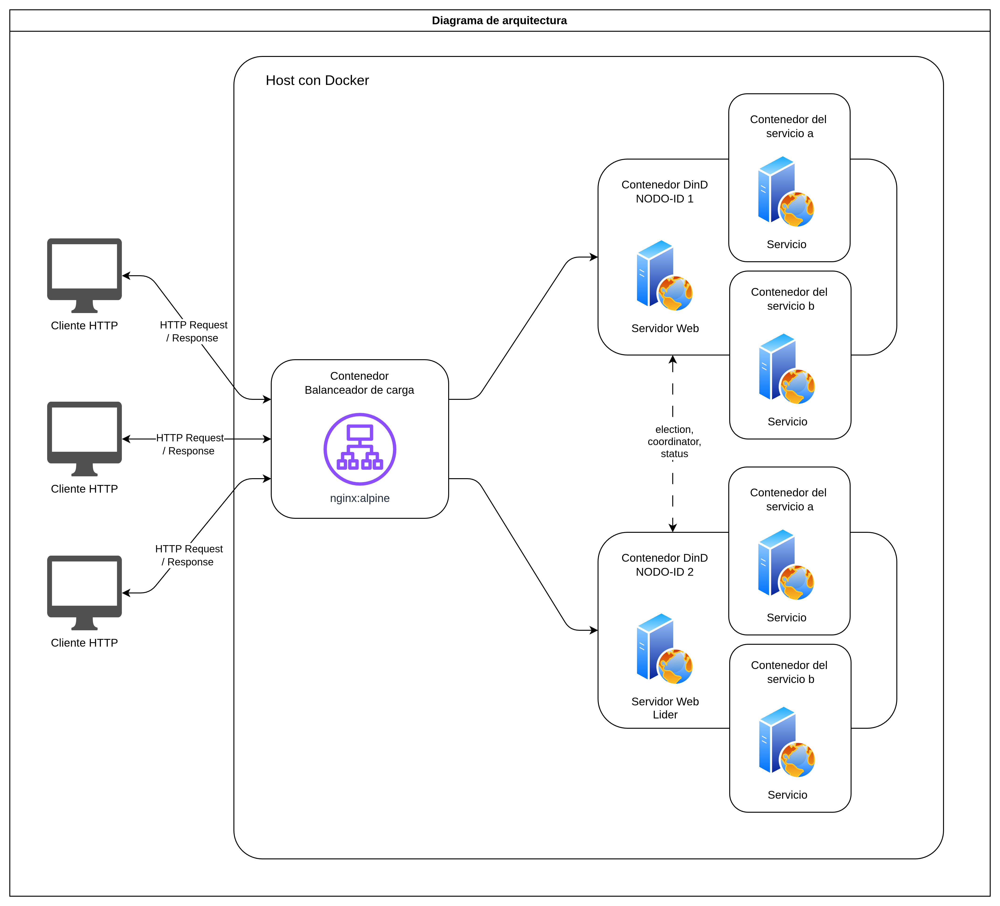

### HIT 3

# Enunciado
Despliegue 2 o más instancias del servidor del Hit #1 detrás de un balanceador de carga (puede usar nginx, HAProxy o un load balancer en la nube).
Implemente un mecanismo de elección de líder utilizando el algoritmo Bully para que uno de los nodos actúe como coordinador del sistema. El coordinador será responsable de:
* Asignar tareas entrantes a los nodos workers disponibles.
* Mantener el registro de estado de cada nodo.
* Si el líder/coordinador se cae (simúlelo matando el proceso), otro nodo debe detectar la caída y tomar el control automáticamente mediante una nueva elección.
Documente en su informe: el diagrama de secuencia de una elección de líder, el tiempo de recuperación ante una caída del coordinador, y cómo se redistribuyen las tareas pendientes.

---

### 1. Requisitos

Software necesario para ejecutar el proyecto.

* Sistema operativo: Linux / macOS / Windows
* Docker y Docker Compose instalados y corriendo en el host
* Lenguaje: Python 3.12
* Dependencias: especificadas en `requirements.txt`

---

### 2. Estructura de archivos

```
hit3/
├── servidor/
│   ├── app/
│   │   ├── api.py
│   │   ├── asignador.py
│   │   ├── bully.py
│   │   └── servidor.py
│   ├── tests/
│   │   └── test_servidor.py
│   ├── Dockerfile
│   └── requirements.txt
├── docker-compose.yml
├── nginx.conf
└── README.md
```

Archivos principales:
* `servidor/app/servidor.py` — nodo servidor con algoritmo Bully incorporado
* `docker-compose.yml` — define los 3 nodos servidores y el balanceador nginx
* `nginx.conf` — configuración del balanceador de carga round-robin

> **Nota:** Los servicios de tareas (inversión de texto y hashing) son los mismos del Hit #1. El servidor consume las imágenes Docker ya publicadas en Docker Hub (`valen190306/sd-tp2-hit1-servicio-a:latest` y `valen190306/sd-tp2-hit1-servicio-b:latest`). 

---

### 3. Arquitectura

```
Cliente
   │
   ▼
nginx (puerto 80) — balanceador round-robin
   │
   ├──► servidor_1 (NODE_ID=1, puerto 8080)
   ├──► servidor_2 (NODE_ID=2, puerto 8080)
   └──► servidor_3 (NODE_ID=3, puerto 8080)
            │
            └── red_interna (bridge Docker)
                  └── contenedores de tareas temporales
```

Los tres nodos se comunican entre sí por la red interna de Docker para ejecutar el algoritmo Bully. nginx distribuye los requests entrantes entre los nodos disponibles.

#### Diagrama de arquitectura



---

### 4. Componentes implementados

| Componente | Descripción |
| ---------- | ----------- |
| Balanceador nginx | Distribuye requests en round-robin entre los 3 nodos. Configurado en `nginx.conf` |
| Algoritmo Bully | Cada nodo tiene un `NODE_ID`. El nodo con ID mayor gana la elección y se proclama líder |
| Monitor de líder | Hilo de fondo que chequea cada 5 segundos si el líder sigue activo |
| Elección automática | Si el líder no responde, el nodo que detecta la caída inicia una nueva elección |
| Endpoints Bully | `/bully/election`, `/bully/coordinator`, `/bully/status` para comunicación entre nodos |

---

### 5. Ejecución

Levantá el stack completo:
```bash
cd hit3
docker compose up -d --build
```

Verificá que todos los nodos están corriendo:
```bash
docker compose ps
```

Resultado esperado:
```
NAME              STATUS    PORTS
hit3-nginx-1      running   0.0.0.0:80->80/tcp
hit3-servidor_1   running   8080/tcp
hit3-servidor_2   running   8080/tcp
hit3-servidor_3   running   8080/tcp
```

---

### 6. Uso del endpoint

Los requests se envían al balanceador nginx en el puerto 80.

**POST** `/getRemoteTask`

Ejemplo — inversión de texto:
```bash
curl -X POST http://localhost/getRemoteTask \
  -H "Content-Type: application/json" \
  -d '{
    "servicio": "texto",
    "payload": {"texto": "hola mundo"}
  }'
```

Ejemplo — hashing:
```bash
curl -X POST http://localhost/getRemoteTask \
  -H "Content-Type: application/json" \
  -d '{
    "servicio": "hash",
    "payload": {"input": "hola", "algoritmo": "sha256"}
  }'
```

---

### 7. Estado del algoritmo Bully

Consultá el estado de líder de cada nodo directamente (sin pasar por nginx):
```bash
# Nodo 1
docker compose exec servidor_1 curl http://localhost:8080/bully/status

# Nodo 2
docker compose exec servidor_2 curl http://localhost:8080/bully/status

# Nodo 3
docker compose exec servidor_3 curl http://localhost:8080/bully/status
```

Resultado esperado (nodo 3 como líder):
```json
{
  "node_id": 3,
  "lider_actual": 3
}
```

---

### 8. Simulación de caída del líder

Para simular la caída del coordinador y observar la re-elección:

```bash
# Identificá cuál nodo es el líder actual
docker compose exec servidor_1 curl http://localhost:8080/bully/status

# Matá el contenedor líder (ejemplo: servidor_3)
docker compose stop servidor_3

# Esperá ~10 segundos y verificá que otro nodo tomó el control
docker compose exec servidor_1 curl http://localhost:8080/bully/status
```

El monitor de fondo detecta la caída en el próximo chequeo (cada 5 segundos) e inicia automáticamente una nueva elección entre los nodos restantes.

---

### 9. Diagrama de secuencia de elección de líder

```
Nodo 1          Nodo 2          Nodo 3 (líder caído)
  │                │                │
  │   detecta caída de Nodo 3       │
  │                │                ✗
  │──ELECTION──►   │
  │                │──ELECTION──►   ✗  (no responde)
  │                │
  │  ◄──OK─────────│  (Nodo 2 tiene ID mayor)
  │                │
  │                │  nadie mayor respondió
  │                │──COORDINATOR──► Nodo 1
  │                │
  │  lider=2       │  lider=2
```

---

### 10. Ejecución de tests

```bash
cd hit3/servidor
pytest tests/test_servidor.py -v
```

---

### 11. Apagado del stack

```bash
docker compose down
```

---

## Conclusión

El Hit #3 agrega alta disponibilidad al sistema del Hit #1. nginx actúa como punto de entrada único y distribuye la carga entre los nodos. El algoritmo Bully garantiza que siempre haya un coordinador activo: ante la caída del líder, los nodos restantes detectan la falla y eligen automáticamente al nodo con mayor ID disponible como nuevo coordinador.
